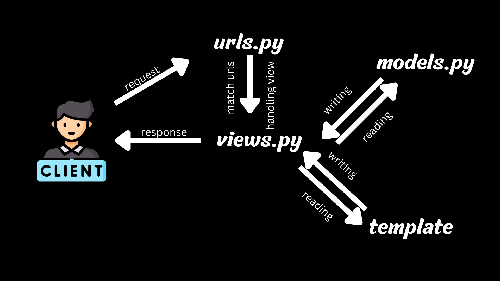

# BLUEBIRD
# ASSIGNMENT 2
## Link : made-izzy-bluebird.pbp.cs.ui.ac.id
## 1. Step-by-Step Implementation:
### 1. Create a new Django project:

Use the command django-admin startproject bluebird to create a new project.
This initializes the necessary files for a Django project, including settings.py and urls.py.

### 2. Create an application named "main":

Inside the project directory, run python manage.py startapp main to create the application.
This adds files like views.py, models.py, and urls.py for handling the logic of the app.

### 3. Perform routing for the "main" app:

In the project’s urls.py, include the routing for the main application by adding

```
from django.urls import path, include
urlpatterns = [
    path('', include('main.urls')),
]
```

### 4. Create a Product model in models.py:

Define the models in main/models.py
name witht a character field with the max length of 100
price with an integer field
description wih a text field
rating with a decimal field 
date with an integer field

```
from django.db import models
class Product(models.Model):
    name = models.CharField(max_length=100)
    price = models.IntegerField()
    description = models.TextField()
    rating = models.DecimalField(max_digits=3, decimal_places=2)  
    date = models.IntegerField()  

    def __str__(self):
        return self.name
```
Run python manage.py makemigrations and python manage.py migrate to apply the database changes.

### 5. make the html file
in your main directory, create a file name template and make a html file named main
in the main.html input this

```
<!DOCTYPE html>
<html lang="en">
<head>
    <meta charset="UTF-8">
    <meta name="viewport" content="width=device-width, initial-scale=1.0">
    <title>main</title>
</head>
<body>
    <h1>{{ app_name }}</h1>
    <p>Name: {{ your_name }}</p>
    <p>Class: {{ your_class }}</p>
</body>
</html>
```

```<!DOCTYPE html>```
means that this document is a HTML5 documen
```<meta charset="UTF-8">```
means that the encoding used in this document is UTF-8
```<meta name="viewport" content="width=device-width, initial-scale=1.0">```
This meta tag ensures that the page scales properly on mobile devices by setting the viewport's width to the device's width and the zoom level to 1.0.
```
<body>
    <h1>{{ app_name }}</h1>
    <p>Name: {{ your_name }}</p>
    <p>Class: {{ your_class }}</p>
</body>
```
so this creates a header with the name {app_name}
a paragraph with your name in it
and a paragraph with your class in it

the part with {} in it will be requested to views.py

### 6. Create a view to display your name and class:
In views.py, define a function

```
from django.shortcuts import render
def show_main(request):
    context = {
        'app_name': 'bluebird', 
        'your_name': 'Made Izzy Prema Dharma',  
        'your_class': 'KKI'  
    }
    return render(request, 'main.html', context)
```

so this code snippet above is used to handle an HTTP request and returns the appropriate view
this code will pass the data from the context dictionary and it will sent to the view

### 7. Create routing for the about view:

In urls.py of the main app, writhe this code
this code 

```
from django.urls import path
from main.views import show_main

app_name = 'main'

urlpatterns = [
    path('', show_main, name='show_main'),
]
```

### 8. Configuring the project URL Routing

Open the urls.py inisde your project directory
Add the following URL route to direct to the main view within the urlpatterns variable.

```
    path('admin/', admin.site.urls),
    path('', include('main.urls')), 

```

### 9. Deplyoing to PWS

Access the PWS page at ```https://pbp.cs.ui.ac.id```
Login into your account
Create a new project
Store your credentials for the project somewhere safe
On you ```settings.py``` in the project directory, add the PWS deployment URL to the allowed host
```

ALLOWED_HOSTS = ["localhost", "127.0.0.1", "<Your PWS deployment URL>"]

```

Run the project command instruction that is in the PWS project page.

## 2. The Diagram



When a user makes a request, the ```urls.py``` file routes the request to a view in the ```views.py``` file, which processes the request and interacts with ```models.py``` for data. The view then uses the ```main.html``` template to format the response, which is sent back to the user's browser.


## 3. Use of Git
```Git``` is used for version control, allowing developers to track changes, collaborate with others, and manage code history. It supports branching, which helps in working on new features without affecting the main codebase, and merging for integrating those features.

## 4. Reason to use Django
Django is beginner-friendly, providing clear structure and built-in features like the ORM and admin panel. Its philosophy of "batteries included" allows students to quickly grasp how web development works with less setup, while still being flexible enough to handle complex projects.Why is the Django model called an ORM?

## 5. What is ORM?
ORM (Object-Relational Mapping) translates database queries into Python code, allowing developers to interact with the database using Python objects. Django’s ORM simplifies the management of database operations, ensuring database-agnostic code.

# ASSIGNMENT 3
## 1. Step-by-Step Implementation:

### 1. Make the input form
Create a new file called ```form.py``` in the ```main``` directory of your file. Inside put the contents as follows :
```
from django.forms import ModelForm
from main.models import Product

class ProductEntryForm(ModelForm):
    class Meta:
        model = Product
        fields = ["name", "price", "description", "rating"]
```

Edit the ```views.py``` file in the ```main``` function. Add these import line to it:

```
...
from django.shortcuts import render, redirect   # Add import redirect at this line
from main.forms import ProductEntryForm
from main.models import Product
...
```

Next, on the same file, create a new function called ```create_product_entry``` that recives a parameter ```request```

```
def create_product_entry(request):
    form = ProductEntryForm(request.POST or None)

    if form.is_valid() and request.method == "POST":
        form.save()
        return redirect('main:show_main')

    context = {'form': form}
    return render(request, "create_product_entry.html", context)
```

On the ```views.py``` file, edit the ```show_main``` function with the following content :

```
def show_main(request):
    product_entries = Product.objects.all() # add this

    context = {
        'app_name': 'bluebird', 
        'your_name': 'Made Izzy Prema Dharma',  
        'your_class': 'KKI',
        'product_entries' : product_entries #add this

    }
    return render(request, 'main.html', context)
```

Next, open the ```urls.py``` file in the ```main``` directory and import the ```create_product_entry``` function.

```
...
from main.views import show_main, create_product_entry, show_xml, show_json, show_xml_by_id, show_json_by_id
...
```

Add the URL path to the ```urlpatterns``` variable in the ```urls.py``` file in the main directory to access the function that was imported above.

```
urlpatterns = [
    ...
    path('create-mood-entry', create_product_entry, name='create_product_entry'),
    ...
```

Create a new HTML file with the name create_product_entry.html in the main/templates directory. Fill it with the following code :

```
 

<h1>Add New Product Entry</h1>

<form method="POST">
  
  <table>
    {{ form.as_table }}
    <tr>
      <td></td>
      <td>
        <input type="submit" value="Add Product Entry" />
      </td>
    </tr>
  </table>
</form>


```

Last step, open ```main.html``` in the ```main/templates``` directory. in there edit the ```main.html``` file as follows :

```

<!DOCTYPE html>
<html lang="en">
  <head>
    <meta charset="UTF-8" />
    <meta name="viewport" content="width=device-width, initial-scale=1.0" />
    <!-- You can add meta tags here -->
  </head>

  <body>
    <h1>{{ app_name }}</h1>
    <p>Name: {{ your_name }}</p>
    <p>Class: {{ your_class }}</p>

    
    <p>There are no product entry yet.</p>
    
    <table>
      <tr>
        <th>Product Name</th>
        <th>Date</th>
        <th>Price</th>
        <th>Description</th>
        <th>Rating</th>
      </tr>

       This is how to display product data 
      
      <tr>
        <td>{{ product_entry.name }}</td>
        <td>{{ product_entry.date }}</td>
        <td>{{ product_entry.price }}</td>
        <td>{{ product_entry.description }}</td>
        <td>{{ product_entry.rating }}</td>
      </tr>
      
    </table>
    

    <br />

    <a href="">
      <button>Add New Product Entry</button>
    </a>
  </body>
</html>
```

### 2.Add 4 views to view the added objects in XML, JSON, XML by ID, and JSON by ID formats.

1. On the ```model.py``` file in the ```main``` directory, add these following codes.

```
...
import uuid
...

class Product(models.Model):
    ...
    id = models.UUIDField(primary_key=True, default=uuid.uuid4, editable=False)
    ...
```

2. Open the ```views.py``` in the ```main``` directory and import these two things
 
```
...
from django.http import HttpResponse
from django.core import serializers
...
```

On the same file, add these lines of code functions

```
...
def show_json_by_id(request, id):
    data = Product.objects.filter(pk=id)
    return HttpResponse(serializers.serialize("json", data), content_type="application/json")

def show_xml_by_id(request, id):
    data = Product.objects.filter(pk=id)
    return HttpResponse(serializers.serialize("xml", data), content_type="application/xml")

def show_json(request):
    data = Product.objects.all()

def show_json(request):
    data = Product.objects.all()
    return HttpResponse(serializers.serialize("json", data), content_type="application/json")

def show_xml(request):
    data = Product.objects.all()
    return HttpResponse(serializers.serialize("xml", data), content_type="application/xml")
...
```
3. ###  Create URL routing for each of the views added.

Open the ```urls.py``` file in the ```main``` directory and import all of the functions we made on ```views.py``` earlier.

```
from main.views import show_main, create_product_entry, show_xml, show_json, show_xml_by_id, show_json_by_id
```

Now, add the URL path to the urlpatterns variable in the urls.py file in the main directory to access the function that was imported.

```
urlpatterns = [
    ...
    path('xml/', show_xml, name='show_xml'),
    path('json/', show_json, name='show_json'),
    path('xml/<str:id>/', show_xml_by_id, name='show_xml_by_id'),
    path('json/<str:id>/', show_json_by_id, name='show_json_by_id'),
    ...
]
```

Lastly, try to run the application by running the ```python manage.py runserver``` command on your command prompt and opening the http://localhost:8000/ link on your browser.

## 2. Why do we need data delivery in implementing a platform?

Data delivery is essential in implementing a platform because it enables the transfer of information between different parts of the platform, such as client-side applications and server-side systems. This ensures that users can access up-to-date data, interact with dynamic content, and perform various actions on the platform, such as creating or modifying data. Without data delivery mechanisms, the platform would be static, lacking interactivity and real-time functionality.

## 3. Which is better, XML or JSON? Why is JSON more popular than XML?

In my opinion, JSON is generally better for most modern applications due to its simplicity, readability, and ease of use with JavaScript. JSON is more lightweight, making it ideal for web services and APIs, where reducing data size is important for speed and performance. JSON’s syntax is also easier for humans to read and write, and it integrates seamlessly with modern web technologies.

JSON is more popular than XML because:
- It has less verbose syntax.
- It’s directly supported by JavaScript, which is widely used in web development.
- It’s easier to parse and more efficient in terms of performance compared to XML.

While XML is still useful for more complex configurations and documents that require a richer structure (such as metadata), JSON is better suited for the majority of modern web applications.

## 4. What is the functional usage of the `is_valid()` method in Django forms? Why do we need this method?

The `is_valid()` method in Django forms is used to check whether the data submitted via a form is valid based on the form’s fields and the associated validation rules. It ensures that all required fields are filled, data types are correct, and custom validation logic is respected. When `is_valid()` returns `True`, the form data can be safely used. If it returns `False`, the form will contain error messages explaining what went wrong.

We need this method to ensure that invalid data doesn't get processed or stored in the database, maintaining the integrity of the application’s data.

## 5. Why do we need `csrf_token` when creating a form in Django? What could happen if we did not use `csrf_token` on a Django form? How could this be leveraged by an attacker?

The `csrf_token` is used to protect forms in Django from Cross-Site Request Forgery (CSRF) attacks. CSRF occurs when an attacker tricks a user into performing unwanted actions on a website where they are authenticated, such as submitting a form on their behalf without their consent.

If we did not use `csrf_token`, an attacker could exploit this vulnerability by crafting malicious links or forms that mimic legitimate requests. For example, they could send a forged form submission to transfer money or change user settings without the user's knowledge. By adding a `csrf_token`, Django ensures that form submissions are coming from a legitimate source.


