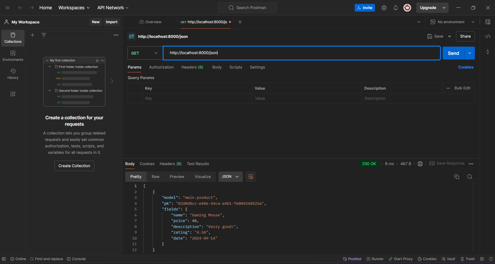

# BLUEBIRD
# ASSIGNMENT 2
## Link : made-izzy-bluebird.pbp.cs.ui.ac.id
## 1. Step-by-Step Implementation:
### 1. Create a new Django project:

Use the command django-admin startproject bluebird to create a new project.
This initializes the necessary files for a Django project, including settings.py and urls.py.

### 2. Create an application named "main":

Inside the project directory, run python manage.py startapp main to create the application.
This adds files like views.py, models.py, and urls.py for handling the logic of the app.

### 3. Perform routing for the "main" app:

In the project’s urls.py, include the routing for the main application by adding

```
from django.urls import path, include
urlpatterns = [
    path('', include('main.urls')),
]
```

### 4. Create a Product model in models.py:

Define the models in main/models.py
name witht a character field with the max length of 100
price with an integer field
description wih a text field
rating with a decimal field 
date with an integer field

```
from django.db import models
class Product(models.Model):
    name = models.CharField(max_length=100)
    price = models.IntegerField()
    description = models.TextField()
    rating = models.DecimalField(max_digits=3, decimal_places=2)  
    date = models.IntegerField()  

    def __str__(self):
        return self.name
```
Run python manage.py makemigrations and python manage.py migrate to apply the database changes.

### 5. make the html file
in your main directory, create a file name template and make a html file named main
in the main.html input this

```
<!DOCTYPE html>
<html lang="en">
<head>
    <meta charset="UTF-8">
    <meta name="viewport" content="width=device-width, initial-scale=1.0">
    <title>main</title>
</head>
<body>
    <h1>{{ app_name }}</h1>
    <p>Name: {{ your_name }}</p>
    <p>Class: {{ your_class }}</p>
</body>
</html>
```

```<!DOCTYPE html>```
means that this document is a HTML5 documen
```<meta charset="UTF-8">```
means that the encoding used in this document is UTF-8
```<meta name="viewport" content="width=device-width, initial-scale=1.0">```
This meta tag ensures that the page scales properly on mobile devices by setting the viewport's width to the device's width and the zoom level to 1.0.
```
<body>
    <h1>{{ app_name }}</h1>
    <p>Name: {{ your_name }}</p>
    <p>Class: {{ your_class }}</p>
</body>
```
so this creates a header with the name {app_name}
a paragraph with your name in it
and a paragraph with your class in it

the part with {} in it will be requested to views.py

### 6. Create a view to display your name and class:
In views.py, define a function

```
from django.shortcuts import render
def show_main(request):
    context = {
        'app_name': 'bluebird', 
        'your_name': 'Made Izzy Prema Dharma',  
        'your_class': 'KKI'  
    }
    return render(request, 'main.html', context)
```

so this code snippet above is used to handle an HTTP request and returns the appropriate view
this code will pass the data from the context dictionary and it will sent to the view

### 7. Create routing for the about view:

In urls.py of the main app, writhe this code
this code 

```
from django.urls import path
from main.views import show_main

app_name = 'main'

urlpatterns = [
    path('', show_main, name='show_main'),
]
```

### 8. Configuring the project URL Routing

Open the urls.py inisde your project directory
Add the following URL route to direct to the main view within the urlpatterns variable.

```
    path('admin/', admin.site.urls),
    path('', include('main.urls')), 

```

### 9. Deplyoing to PWS

Access the PWS page at ```https://pbp.cs.ui.ac.id```
Login into your account
Create a new project
Store your credentials for the project somewhere safe
On you ```settings.py``` in the project directory, add the PWS deployment URL to the allowed host
```

ALLOWED_HOSTS = ["localhost", "127.0.0.1", "<Your PWS deployment URL>"]

```

Run the project command instruction that is in the PWS project page.

## 2. The Diagram


When a user makes a request, the ```urls.py``` file routes the request to a view in the ```views.py``` file, which processes the request and interacts with ```models.py``` for data. The view then uses the ```main.html``` template to format the response, which is sent back to the user's browser.


## 3. Use of Git
```Git``` is used for version control, allowing developers to track changes, collaborate with others, and manage code history. It supports branching, which helps in working on new features without affecting the main codebase, and merging for integrating those features.

## 4. Reason to use Django
Django is beginner-friendly, providing clear structure and built-in features like the ORM and admin panel. Its philosophy of "batteries included" allows students to quickly grasp how web development works with less setup, while still being flexible enough to handle complex projects.Why is the Django model called an ORM?

## 5. What is ORM?
ORM (Object-Relational Mapping) translates database queries into Python code, allowing developers to interact with the database using Python objects. Django’s ORM simplifies the management of database operations, ensuring database-agnostic code.

# ASSIGNMENT 3
## 1. Step-by-Step Implementation:

### 1. Make the input form
Create a new file called ```form.py``` in the ```main``` directory of your file. Inside put the contents as follows :
```
from django.forms import ModelForm
from main.models import Product

class ProductEntryForm(ModelForm):
    class Meta:
        model = Product
        fields = ["name", "price", "description", "rating"]
```

Edit the ```views.py``` file in the ```main``` function. Add these import line to it:

```
...
from django.shortcuts import render, redirect   # Add import redirect at this line
from main.forms import ProductEntryForm
from main.models import Product
...
```

Next, on the same file, create a new function called ```create_product_entry``` that recives a parameter ```request```

```
def create_product_entry(request):
    form = ProductEntryForm(request.POST or None)

    if form.is_valid() and request.method == "POST":
        form.save()
        return redirect('main:show_main')

    context = {'form': form}
    return render(request, "create_product_entry.html", context)
```

On the ```views.py``` file, edit the ```show_main``` function with the following content :

```
def show_main(request):
    product_entries = Product.objects.all() # add this

    context = {
        'app_name': 'bluebird', 
        'your_name': 'Made Izzy Prema Dharma',  
        'your_class': 'KKI',
        'product_entries' : product_entries #add this

    }
    return render(request, 'main.html', context)
```

Next, open the ```urls.py``` file in the ```main``` directory and import the ```create_product_entry``` function.

```
...
from main.views import show_main, create_product_entry, show_xml, show_json, show_xml_by_id, show_json_by_id
...
```

Add the URL path to the ```urlpatterns``` variable in the ```urls.py``` file in the main directory to access the function that was imported above.

```
urlpatterns = [
    ...
    path('create-mood-entry', create_product_entry, name='create_product_entry'),
    ...
```

In the root directory, make a new directory called templates. In there, make a new file called base.html with the following codes in it

```

<!DOCTYPE html>
<html lang="en">
  <head>
    <meta charset="UTF-8" />
    <meta name="viewport" content="width=device-width, initial-scale=1.0" />
     
  </head>

  <body>
     
  </body>
</html>
```

Create a new HTML file with the name create_product_entry.html in the main/templates directory. Fill it with the following code :

```
 

<h1>Add New Product Entry</h1>

<form method="POST">
  
  <table>
    {{ form.as_table }}
    <tr>
      <td></td>
      <td>
        <input type="submit" value="Add Product Entry" />
      </td>
    </tr>
  </table>
</form>


```

Then, open ```main.html``` in the ```main/templates``` directory. in there edit the ```main.html``` file as follows :

```


<h1>{{ app_name }}</h1>
<p>Name: {{ your_name }}</p>
<p>Class: {{ your_class }}</p>

<p>There are no product entry yet.</p>

<table>
  <tr>
    <th>Product Name</th>
    <th>Date</th>
    <th>Price</th>
    <th>Desicription</th>
    <th>Rating</th>
  </tr>

   This is how to display product data
   
  
  <tr>
    <td>{{product_entry.name}}</td>
    <td>{{product_entry.date}}</td>
    <td>{{product_entry.price}}</td>
    <td>{{product_entry.description}}</td>
    <td>{{product_entry.rating}}</td>
  </tr>
  
</table>


<br />

<a href="">
  <button>Add New Product Entry</button>
</a>

```
Lastly, open ```settings.py``` on your project directory, and add this to the template variable

```
...
TEMPLATES = [
    {
        'BACKEND': 'django.template.backends.django.DjangoTemplates',
        'DIRS': [BASE_DIR / 'templates'], # add this
        'APP_DIRS': True,
...
```

### 2.Add 4 views to view the added objects in XML, JSON, XML by ID, and JSON by ID formats.

1. On the ```model.py``` file in the ```main``` directory, add these following codes.

```
...
import uuid
...

class Product(models.Model):
    ...
    id = models.UUIDField(primary_key=True, default=uuid.uuid4, editable=False)
    ...
```

2. Open the ```views.py``` in the ```main``` directory and import these two things
 
```
...
from django.http import HttpResponse
from django.core import serializers
...
```

On the same file, add these lines of code functions

```
...
def show_json_by_id(request, id):
    data = Product.objects.filter(pk=id)
    return HttpResponse(serializers.serialize("json", data), content_type="application/json")

def show_xml_by_id(request, id):
    data = Product.objects.filter(pk=id)
    return HttpResponse(serializers.serialize("xml", data), content_type="application/xml")

def show_json(request):
    data = Product.objects.all()

def show_json(request):
    data = Product.objects.all()
    return HttpResponse(serializers.serialize("json", data), content_type="application/json")

def show_xml(request):
    data = Product.objects.all()
    return HttpResponse(serializers.serialize("xml", data), content_type="application/xml")
...
```
3. ###  Create URL routing for each of the views added.

Open the ```urls.py``` file in the ```main``` directory and import all of the functions we made on ```views.py``` earlier.

```
from main.views import show_main, create_product_entry, show_xml, show_json, show_xml_by_id, show_json_by_id
```

Now, add the URL path to the urlpatterns variable in the urls.py file in the main directory to access the function that was imported.

```
urlpatterns = [
    ...
    path('xml/', show_xml, name='show_xml'),
    path('json/', show_json, name='show_json'),
    path('xml/<str:id>/', show_xml_by_id, name='show_xml_by_id'),
    path('json/<str:id>/', show_json_by_id, name='show_json_by_id'),
    ...
]
```

Lastly, try to run the application by running the ```python manage.py runserver``` command on your command prompt and opening the http://localhost:8000/ link on your browser.

## 2. Why do we need data delivery in implementing a platform?

Data delivery is essential in implementing a platform because it enables the transfer of information between different parts of the platform, such as client-side applications and server-side systems. This ensures that users can access up-to-date data, interact with dynamic content, and perform various actions on the platform, such as creating or modifying data. Without data delivery mechanisms, the platform would be static, lacking interactivity and real-time functionality.

## 3. Which is better, XML or JSON? Why is JSON more popular than XML?

In my opinion, JSON is generally better for most modern applications due to its simplicity, readability, and ease of use with JavaScript. JSON is more lightweight, making it ideal for web services and APIs, where reducing data size is important for speed and performance. JSON’s syntax is also easier for humans to read and write, and it integrates seamlessly with modern web technologies.

JSON is more popular than XML because:
- It has less verbose syntax.
- It’s directly supported by JavaScript, which is widely used in web development.
- It’s easier to parse and more efficient in terms of performance compared to XML.

While XML is still useful for more complex configurations and documents that require a richer structure (such as metadata), JSON is better suited for the majority of modern web applications.

## 4. What is the functional usage of the `is_valid()` method in Django forms? Why do we need this method?

The `is_valid()` method in Django forms is used to check whether the data submitted via a form is valid based on the form’s fields and the associated validation rules. It ensures that all required fields are filled, data types are correct, and custom validation logic is respected. When `is_valid()` returns `True`, the form data can be safely used. If it returns `False`, the form will contain error messages explaining what went wrong.

We need this method to ensure that invalid data doesn't get processed or stored in the database, maintaining the integrity of the application’s data.

## 5. Why do we need `csrf_token` when creating a form in Django? What could happen if we did not use `csrf_token` on a Django form? How could this be leveraged by an attacker?

The `csrf_token` is used to protect forms in Django from Cross-Site Request Forgery (CSRF) attacks. CSRF occurs when an attacker tricks a user into performing unwanted actions on a website where they are authenticated, such as submitting a form on their behalf without their consent.

If we did not use `csrf_token`, an attacker could exploit this vulnerability by crafting malicious links or forms that mimic legitimate requests. For example, they could send a forged form submission to transfer money or change user settings without the user's knowledge. By adding a `csrf_token`, Django ensures that form submissions are coming from a legitimate source.

### Screenshot from postman

1. **JSON**



2. **XML**
   


3. **JSON by ID**
   


4. **XML by ID**

 


# ASSIGNMENT 4

## 1. Step-by-Step Implementation:
### Implementing register function
In ```view.py``` in the ```main``` subdirectory import these library
```
from django.contrib.auth.forms import UserCreationForm
from django.contrib import messages
```
Then, add the register function to the ```views.py```
```
def register(request):
    form = UserCreationForm()

    if request.method == "POST":
        form = UserCreationForm(request.POST)
        if form.is_valid():
            form.save()
            messages.success(request, 'Your account has been successfully created!')
            return redirect('main:login')
    context = {'form':form}
    return render(request, 'register.html', context)
```
Create a new HTML file named ```register.html``` in the ```main/templates``` directory

```
 
<title>Register</title>
 

<div class="login">
  <h1>Register</h1>

  <form method="POST">
    
    <table>
      {{ form.as_table }}
      <tr>
        <td></td>
        <td><input type="submit" name="submit" value="Register" /></td>
      </tr>
    </table>
  </form>

  
  <ul>
    
    <li>{{ message }}</li>
    
  </ul>
  
</div>


```
Open ```urls.py``` in the ```main``` directory and import the register function

```from main.views import register```

add the url path to ```urlpatterns``` to access the imported function.

```
 urlpatterns = [
     ...
     path('register/', register, name='register'),
 ]
```

### Implementing login function

Open ```view.py``` in the ```main``` directory and add these import functions

```
from django.contrib.auth.forms import UserCreationForm, AuthenticationForm
from django.contrib.auth import authenticate, login
```

Add the following ```login_user``` function to ```views.py``` 

```
def login_user(request):
   if request.method == 'POST':
      form = AuthenticationForm(data=request.POST)

      if form.is_valid():
            user = form.get_user()
            login(request, user)
            return redirect('main:show_main')

   else:
      form = AuthenticationForm(request)
   context = {'form': form}
   return render(request, 'login.html', context)
```

Create a new HTML name ```login.html``` in the ```main/templates``` directory

```



<title>Login</title>



<div class="login">
  <h1>Login</h1>

  <form method="POST" action="">
    
    <table>
      {{ form.as_table }}
      <tr>
        <td></td>
        <td><input class="btn login_btn" type="submit" value="Login" /></td>
      </tr>
    </table>
  </form>

  
  <ul>
    
    <li>{{ message }}</li>
    
  </ul>
   Don't have an account yet?
  <a href="">Register Now</a>
</div>


```

Open ```urls.py``` in the ```main``` directory and import the login function

```from main.views import login_user```

Add the URL path to ```urlpatterns``` to access the function

```
urlpatterns = [
   ...
   path('login/', login_user, name='login'),
]
```

### Implementing logout function

Open ```views.py``` and add the ```logout``` import


```from django.contrib.auth import logout```


Add the ```logout_user``` to ```views.py```

```
def logout_user(request):
    logout(request)
    return redirect('main:login')
```

Open ```main.html``` file in the ```main/templates``` directory and add the following code snippet after the hyperlink tag for "Add New Mood Entry."

```
...
<a href="">
  <button>Logout</button>
</a>
...
```

Open ```urls.py``` and import the ```logout_user``` function


```from main.views import logout_user```

Add the URL path to ```urlpatterns``` to access the function you imported earlier.

```
urlpatterns = [
   ...
   path('logout/', logout_user, name='logout'),
]
```

### Restricting Access to the Main Page

Open ```views.py``` in the main subdirectory and add ```the login_required``` import.

```from django.contrib.auth.decorators import login_required```

Add the code snippet ```@login_required(login_url='/login')``` above the ```show_main``` function so that the main page can only be accessed by authenticated (logged-in) users.

```
...
@login_required(login_url='/login')
def show_main(request):
...
```

### Display logged in user details such as username and apply cookies like last login to the application's main page.

Open ```views.py``` in the ```main``` directory and add these imports

```
import datetime
from django.http import HttpResponseRedirect
from django.urls import reverse
```

In the ```login_user``` function, we will add the functionality to set a cookie named ```last_login```. Replace the code in the ```if form.is_valid()``` block with the following code

```
...
if form.is_valid():
    user = form.get_user()
    login(request, user)
    response = HttpResponseRedirect(reverse("main:show_main"))
    response.set_cookie('last_login', str(datetime.datetime.now()))
    return response
...
```

In the ```show_main``` function, add the snippet ```'last_login': request.COOKIES['last_login'],``` in the context variable

```
context = {
    'name': 'Pak Bepe',
    'class': 'PBP D',
    'npm': '2306123456',
    'mood_entries': mood_entries,
    'last_login': request.COOKIES['last_login'],
}
```

Change the ```logout_user``` function to be like this

```
def logout_user(request):
    logout(request)
    response = HttpResponseRedirect(reverse('main:login'))
    response.delete_cookie('last_login')
    return response
```

Open the ```main.html``` and add this code after the logout button

```
...
<h5>Last login session: {{ last_login }}</h5>
...
```

### Connect the models Product and User

Open ```models.py``` in the main subdirectory and add the following code below the line that imports the model:

```
...
from django.contrib.auth.models import User
...
```

In the previously created ```Product``` model, add the following code:

```
class Product(models.Model):
    user = models.ForeignKey(User, on_delete=models.CASCADE) 
    ...
```

Reopen ```views.py``` in the main subdirectory and modify the code in the ```create_product_entry``` function as follows:

```
def create_product_entry(request):
    form = ProductEntryForm(request.POST or None)

    if form.is_valid() and request.method == "POST":
        mood_entry = form.save(commit=False)
        mood_entry.user = request.user
        mood_entry.save()
        return redirect('main:show_main')

    context = {'form': form}
    return render(request, "create_product_entry.html", context)
 ...
```

Change the value of ```product_entries``` and ```context``` in the function ```show_main``` as follows.

```
def show_main(request):
    product_entries = Product.objects.filter(user=request.user)

    context = {
        ...
        'your_name': request.user.username,
        ...
    }
...
```

Save all changes and run the model migration with python ```manage.py makemigrations```.

If you encounter any errors during the model migration. Just need to select ```1```.

Run ```python manage.py migrate``` to apply the migration made in the previous step.

Lastly, open ```settings.py``` in the ```bluebird``` directory and add this impor

```
import os
```

Then, change the variable ```DEBUG``` in ```settings.py``` into this.

```
PRODUCTION = os.getenv("PRODUCTION", False)
DEBUG = not PRODUCTION
```

## Difference between HttpResponseRedirect() and redirect()

* ```HttpResponseRedirect()``` is a class-based response that specifically handles HTTP redirection by returning a status code (302) and a new URL. It requires an explicit URL to be passed as an argument.
* ```redirect()``` is a shortcut function that internally calls ```HttpResponseRedirect()``` and simplifies the redirection process by accepting a URL, a view name, or an object. It automatically resolves the URL if a view name or object is provided.

## How the Product model is linked with User

In the ```Product``` model, we establish a relationship with Django’s built-in ```User```model by adding a ```ForeignKey``` field that links each product entry to a specific user. This is done by importing the ```User``` model from ```django.contrib.auth.models``` and adding ```user = models.ForeignKey(User, on_delete=models.CASCADE)``` to the ```Product``` model. The ForeignKey ensures that each product entry is associated with a user, and if the user is deleted, their associated product entries are also removed from the database. Additionally, when creating a new product entry in the ```views.py``` file, we use ```commit=False``` to delay saving the form so that we can assign the ```user``` field to the currently logged-in user (```request.user```). This way, each product entry is saved with a reference to the user who created it. When displaying product entries on the main page, we filter them by the logged-in user, ensuring that users only see their own entries.

## Difference Between Authentication and Authorization

* Authentication is the process of verifying the identity of a user (e.g., checking their username and password).
* Authorization determines what actions or resources the authenticated user has permission to access.

When a user logs in, Django verifies their credentials (authentication) and then associates the user with specific permissions and roles (authorization) to control access.

Django handles authentication through its built-in ```django.contrib.auth system```, which includes tools for user login, logout, password management, and more.

## How Django Remembers Logged-In Users

Django uses session cookies to remember logged-in users. When a user successfully logs in, Django creates a session for that user and sets a cookie in their browser. This cookie stores the session ID, which Django uses to identify the user in subsequent requests.

# ASSIGNMENT 1
## Step by step implementation
### adding delete and edit function

open ```views.py``` add this import ``` from django.shortcuts import .., reverse``` and add these two function:

```
def delete_product(request, id):
    # Get mood based on id
    product = Product.objects.get(pk = id)
    # Delete mood
    product.delete()
    # Return to home page
    return HttpResponseRedirect(reverse('main:show_main'))

def edit_product(request, id):
    # Get mood entry based on id
    product = Product.objects.get(pk = id)

    # Set mood entry as an instance of the form
    form = ProductEntryForm(request.POST or None, instance=product)

    if form.is_valid() and request.method == "POST":
        # Save form and return to home page
        form.save()
        return HttpResponseRedirect(reverse('main:show_main'))

    context = {'form': form}
    return render(request, "edit_product.html", context)
```

open ```urls.py``` add the following function to the import and urlpattern

```from main.views import edit_product, delete_product,```

```
urlpatterns = [
    ...
    path('edit_product/<uuid:id>/', edit_product, name='edit_product'),
    path('delete/<uuid:id>', delete_product, name='delete_product'),
]
```

Create a new HTML file named ```navbar.html``` in the ```templates/``` folder in the root directory. You can fill the ```navbar.html``` with the following template.

```
<nav class="bg-blue-600 shadow-lg fixed top-0 left-0 z-40 w-screen">
    <div class="max-w-7xl mx-auto px-4 sm:px-6 lg:px-8">
        <div class="flex items-center justify-between h-16">
            <div class="flex items-center">
                <h1 class="text-2xl font-bold text-center text-white">Bluebird</h1>
            </div>
            <div class="hidden md:flex items-center">
                <a href="" class="text-white px-4">Home</a>
                
                    <span class="text-gray-300 mr-4">Welcome, {{ user.username }}</span>
                    <a href="" class="text-center bg-red-500 hover:bg-red-600 text-white font-bold py-2 px-4 rounded transition duration-300">
                        Logout
                    </a>
                
                    <a href="" class="text-center bg-blue-500 hover:bg-blue-600 text-white font-bold py-2 px-4 rounded transition duration-300 mr-2">
                        Login
                    </a>
                    <a href="" class="text-center bg-green-500 hover:bg-green-600 text-white font-bold py-2 px-4 rounded transition duration-300">
                        Register
                    </a>
                
            </div>
            <div class="md:hidden flex items-center">
                <button class="mobile-menu-button">
                    <svg class="w-6 h-6 text-white" fill="none" stroke-linecap="round" stroke-linejoin="round" stroke-width="2" viewBox="0 0 24 24" stroke="currentColor">
                        <path d="M4 6h16M4 12h16M4 18h16"></path>
                    </svg>
                </button>
            </div>
        </div>
    </div>
    <!-- Mobile menu -->
    <div class="mobile-menu hidden md:hidden px-4 w-full md:max-w-full">
        <div class="pt-2 pb-3 space-y-1 mx-auto">
            <a href="" class="block text-center text-white hover:bg-blue-700 py-2">Home</a>
            
                <span class="block text-gray-300 px-3 py-2">Welcome, {{ user.username }}</span>
                <a href="" class="block text-center bg-red-500 hover:bg-red-600 text-white font-bold py-2 px-4 rounded transition duration-300">
                    Logout
                </a>
            
                <a href="" class="block text-center bg-blue-500 hover:bg-blue-600 text-white font-bold py-2 px-4 rounded transition duration-300 mb-2">
                    Login
                </a>
                <a href="" class="block text-center bg-green-500 hover:bg-green-600 text-white font-bold py-2 px-4 rounded transition duration-300">
                    Register
                </a>
            
        </div>
    </div>
    <script>
        const btn = document.querySelector("button.mobile-menu-button");
        const menu = document.querySelector(".mobile-menu");

        btn.addEventListener("click", () => {
            menu.classList.toggle("hidden");
        });
    </script>
</nav>
```

### Configure static file

In ```settings.py```, add the WhiteNoise middleware.

```
...
MIDDLEWARE = [
    'django.middleware.security.SecurityMiddleware',
    'whitenoise.middleware.WhiteNoiseMiddleware', # Add it directly under SecurityMiddleware
    ...
]
...
```

In settings.py, ensure that the ```STATIC_ROOT```, ```STATICFILES_DIRS```, and ```STATIC_URL``` variables are configured like this:

```
...
STATIC_URL = '/static/'
if DEBUG:
    STATICFILES_DIRS = [
        BASE_DIR / 'static' # refers to /static root project in development mode
    ]
else:
    STATIC_ROOT = BASE_DIR / 'static' # refers to /static root project in production mode
...
```

### Customizing using Tailwind

add a new folder in root directiory named ``` static/css``` and add a new file ```globla.css``` and Modify the global.css file in ```static/css/global.css``` as follows:

```
.form-style form input, 
.form-style form textarea, 
.form-style form select {
    width: 100%;
    padding: 0.5rem;
    border: 2px solid #007bff; /* Change border color to blue */
    border-radius: 0.375rem;
    transition: border-color 0.3s; /* Smooth transition for border color */
}

.form-style form input:focus, 
.form-style form textarea:focus, 
.form-style form select:focus {
    outline: none;
    border-color: #674ea7; /* Keep this for focus state */
    box-shadow: 0 0 0 3px #674ea7;
}

@keyframes shine {
    0% { background-position: -200% 0; }
    100% { background-position: 200% 0; }
}

.animate-shine {
    background: linear-gradient(120deg, rgba(255, 255, 255, 0.3), rgba(255, 255, 255, 0.1) 50%, rgba(255, 255, 255, 0.3));
    background-size: 200% 100%;
    animation: shine 3s infinite;
}

@keyframes pulse {
    0%, 100% { transform: scale(1); }
    50% { transform: scale(1.05); }
}

.animate-pulse {
    animation: pulse 1s infinite;
}

.pulsate:hover {
    animation: pulse 1s infinite;
}

```

For the CSS styles added in ```global.css``` to be used in Django templates, you need to add that file to base.html. Modify your ```base.html``` file as follows:

```

<!DOCTYPE html>
<html lang="en">
  <head>
    <meta charset="UTF-8" />
    <meta name="viewport" content="width=device-width, initial-scale=1.0" />
     
    <script src="https://cdn.tailwindcss.com"></script>
    <link rel="stylesheet" href=""/>
  </head>
  <body>
     
  </body>
</html>
```

### Styling login page

Change the ```login.html``` file in the ```main/templates/``` subdirectory to be as follows:

```



<title>Login</title>



<div class="min-h-screen flex items-center justify-center w-screen bg-gray-100 py-12 px-4 sm:px-6 lg:px-8">
  <div class="max-w-md w-full space-y-8">
    <div>
      <h2 class="mt-6 text-center text-black text-3xl font-extrabold text-gray-900">
        Login to your account
      </h2>
    </div>
    <form class="mt-8 space-y-6" method="POST" action="">
      
      <input type="hidden" name="remember" value="true">
      <div class="rounded-md shadow-sm -space-y-px">
        <div>
          <label for="username" class="sr-only">Username</label>
          <input id="username" name="username" type="text" required class="appearance-none rounded-none relative block w-full px-3 py-2 border border-gray-300 placeholder-gray-500 text-gray-900 rounded-t-md focus:outline-none focus:ring-blue-500 focus:border-blue-500 focus:z-10 sm:text-sm" placeholder="Username">
        </div>
        <div>
          <label for="password" class="sr-only">Password</label>
          <input id="password" name="password" type="password" required class="appearance-none rounded-none relative block w-full px-3 py-2 border border-gray-300 placeholder-gray-500 text-gray-900 rounded-b-md focus:outline-none focus:ring-blue-500 focus:border-blue-500 focus:z-10 sm:text-sm" placeholder="Password">
        </div>
      </div>

      <div>
        <button type="submit" class="group relative w-full flex justify-center py-2 px-4 border border-transparent text-sm font-medium rounded-md text-white bg-blue-600 hover:bg-blue-700 focus:outline-none focus:ring-2 focus:ring-offset-2 focus:ring-blue-500">
          Sign in
        </button>
      </div>
    </form>

    
    <div class="mt-4">
      
      
            <div class="bg-green-100 border border-green-400 text-green-700 px-4 py-3 rounded relative" role="alert">
                <span class="block sm:inline">{{ message }}</span>
            </div>
        
            <div class="bg-red-100 border border-red-400 text-red-700 px-4 py-3 rounded relative" role="alert">
                <span class="block sm:inline">{{ message }}</span>
            </div>
        
            <div class="bg-blue-100 border border-blue-400 text-blue-700 px-4 py-3 rounded relative" role="alert">
                <span class="block sm:inline">{{ message }}</span>
            </div>
        
      
    </div>
    

    <div class="text-center mt-4">
      <p class="text-sm text-black">
        Don't have an account yet?
        <a href="" class="font-medium text-blue-200 hover:text-blue-300">
          Register Now
        </a>
      </p>
    </div>
  </div>
</div>

```

### Styling register page

Change the ```register.html``` file in the ```main/templates/``` subdirectory to be as follows:

```



<title>Register</title>



<div class="min-h-screen flex items-center justify-center bg-gray-100 py-12 px-4 sm:px-6 lg:px-8">
  <div class="max-w-md w-full space-y-8 form-style">
    <div>
      <h2 class="mt-6 text-center text-3xl font-extrabold text-black">
        Create your account
      </h2>
    </div>
    <form class="mt-8 space-y-6" method="POST">
      
      <input type="hidden" name="remember" value="true">
      <div class="rounded-md shadow-sm -space-y-px">
        
          <div class="mt-4">
            <label for="{{ field.id_for_label }}" class="mb-2 font-semibold text-black">
              {{ field.label }}
            </label>
            <div class="relative">
              {{ field }}
              <div class="absolute inset-y-0 right-0 pr-3 flex items-center pointer-events-none">
                
                  <svg class="h-5 w-5 text-red-500" fill="currentColor" viewBox="0 0 20 20">
                    <path fill-rule="evenodd" d="M18 10a8 8 0 11-16 0 8 8 0 0116 0zm-7 4a1 1 0 11-2 0 1 1 0 012 0zm-1-9a1 1 0 00-1 1v4a1 1 0 102 0V6a1 1 0 00-1-1z" clip-rule="evenodd" />
                  </svg>
                
              </div>
            </div>
            
              
                <p class="mt-1 text-sm text-red-600">{{ error }}</p>
              
            
          </div>
        
      </div>

      <div>
        <button type="submit" class="group relative w-full flex justify-center py-2 px-4 border border-transparent text-sm font-medium rounded-md text-white bg-blue-600 hover:bg-blue-700 focus:outline-none focus:ring-2 focus:ring-offset-2 focus:ring-blue-500">
          Register
        </button>
      </div>
    </form>

    
    <div class="mt-4">
      
      <div class="bg-red-100 border border-red-400 text-red-700 px-4 py-3 rounded relative" role="alert">
        <span class="block sm:inline">{{ message }}</span>
      </div>
      
    </div>
    

    <div class="text-center mt-4">
      <p class="text-sm text-black">
        Already have an account?
        <a href="" class="font-medium text-blue-200 hover:text-blue-300">
          Login here
        </a>
      </p>
    </div>
  </div>
</div>

```

### Styling Home Page

Create a ```card_info.html``` file in the ```main/templates``` directory, then add the following HTML code:

```
<div class="bg-blue-700 rounded-xl overflow-hidden border-2 border-blue-800">
    <div class="p-4 animate-shine  animate-pulse">
      <h5 class="text-lg font-semibold text-gray-200">{{ title }}</h5>
      <p class="text-white">{{ value }}</p>
    </div>
</div>
```

Create a ```card_product.html``` file in the ```main/templates``` directory, then add the following HTML code:

```
<div class="relative break-inside-avoid">
    <div class="absolute top-2 z-10 left-1/2 -translate-x-1/2 flex items-center -space-x-2">
      <div class="w-[3rem] h-8 bg-gray-200 rounded-md opacity-80 -rotate-90"></div>
      <div class="w-[3rem] h-8 bg-gray-200 rounded-md opacity-80 -rotate-90"></div>
    </div>
    <div class="relative top-5 bg-blue-100 shadow-md rounded-lg mb-6 break-inside-avoid flex flex-col border-2 border-blue-300 transform rotate-1 hover:rotate-0 transition-transform duration-300">
      <div class="bg-blue-200 text-gray-800 p-4 rounded-t-lg border-b-2 border-blue-300">
        <h3 class="font-bold text-xl mb-2">{{ product_entry.name }}</h3>
        <p class="text-gray-600">Release Date: {{ product_entry.date }}</p>
      </div>
      <div class="p-4">
        <p class="font-semibold text-lg mb-2">Description</p> 
        <p class="text-gray-700 mb-4">{{ product_entry.description }}</p>
  
        <p class="font-semibold text-lg mb-2">Price</p>
        <p class="text-gray-700 mb-4">${{ product_entry.price }}</p>
  
        <p class="font-semibold text-lg mb-2">Rating</p>
        <div class="flex items-center mb-4">
          <div class="overflow-hidden h-2 mb-4 text-xs flex rounded bg-blue-200 w-full">
            <div style="width:{{ product_entry.rating }}0%" class="shadow-none flex flex-col text-center whitespace-nowrap text-white justify-center bg-blue-500"></div>
          </div>
          <span class="ml-3 text-xs font-semibold text-gray-700">{{ product_entry.rating }} / 10</span>
        </div>
      </div>
    </div>
    <div class="absolute top-0 -right-4 flex space-x-1">
      <a href="" class="bg-yellow-500 hover:bg-yellow-600 text-white rounded-full p-2 transition duration-300 shadow-md">
        <svg xmlns="http://www.w3.org/2000/svg" class="h-9 w-9" viewBox="0 0 20 20" fill="currentColor">
          <path d="M13.586 3.586a2 2 0 112.828 2.828l-.793.793-2.828-2.828.793-.793zM11.379 5.793L3 14.172V17h2.828l8.38-8.379-2.83-2.828z" />
        </svg>
      </a>
      <a href="" class="bg-red-500 hover:bg-red-600 text-white rounded-full p-2 transition duration-300 shadow-md">
        <svg xmlns="http://www.w3.org/2000/svg" class="h-9 w-9" viewBox="0 0 20 20" fill="currentColor">
          <path fill-rule="evenodd" d="M9 2a1 1 0 00-.894.553L7.382 4H4a1 1 0 000 2v10a2 2 0 002 2h8a2 2 0 002-2V6a1 1 0 100-2h-3.382l-.724-1.447A1 1 0 0011 2H9zM7 8a1 1 0 012 0v6a1 1 0 11-2 0V8zm5-1a1 1 0 00-1 1v6a1 1 0 102 0V8a1 1 0 00-1-1z" clip-rule="evenodd" />
        </svg>
      </a>
    </div>
  </div>
```

Create a new folder in your ```static``` folder named ```image```, in there add a new image named ```very-sad.png``` 
 
then, Modify main.html like this:

```




<title>Bluebird</title>



<div class="overflow-x-hidden px-4 md:px-8 pb-8 pt-24 min-h-screen bg-gray-100 flex flex-col">
  <div class="p-2 mb-6 relative">
    <div class="relative grid grid-cols-1 z-30 md:grid-cols-3 gap-8">
      
      
      
    </div>
    <div class="w-full px-6  absolute top-[44px] left-0 z-20 hidden md:flex">
      <div class="w-full min-h-4 bg-blue-700">
      </div>
    </div>
    <div class="h-full w-full py-6  absolute top-0 left-0 z-20 md:hidden flex ">
      <div class="h-full min-w-4 bg-blue-700 mx-auto">
      </div>
    </div>
</div>
    <div class="px-3 mb-4">
      <div class="flex rounded-md items-center bg-blue-600 py-2 px-4 w-fit">
        <h1 class="text-white text-center">Last Login: {{last_login}}</h1>
      </div>
    </div>
    <div class="flex justify-end mb-6">
        <a href="" class="bg-blue-600 hover:bg-blue-700 text-white font-bold py-2 px-4 rounded-lg transition duration-300 ease-in-out transform hover:-translate-y-1 hover:scale-105">
            Add New Product
        </a>
    </div>
    
    
    <div class="flex flex-col items-center justify-center min-h-[24rem] p-6">
        
        <p class="text-center text-gray-600 mt-4">There is no product yet.</p>
    </div>
    
    <div class="columns-1 sm:columns-2 lg:columns-3 gap-6 space-y-6 w-full">
        
            
        
    </div>
    
</div>

```

### Styling the Create Mood Entry Page

Modify the ```create_product_entry.html``` file in the ```main/templates``` subdirectory as follows:

```



<title>Create Product</title>





<div class="flex flex-col min-h-screen bg-gray-100">
  <div class="container mx-auto px-4 py-8 mt-16 max-w-xl">
    <h1 class="text-3xl font-bold text-center mb-8 text-black">Create Product Entry</h1>
  
    <div class="bg-white shadow-md rounded-lg p-6 form-style">
      <form method="POST" class="space-y-6">
        
        
          <div class="flex flex-col">
            <label for="{{ field.id_for_label }}" class="mb-2 font-semibold text-gray-700">
              {{ field.label }}
            </label>
            <div class="w-full">
              {{ field }}
            </div>
            
              <p class="mt-1 text-sm text-gray-500">{{ field.help_text }}</p>
            
            
              <p class="mt-1 text-sm text-red-600">{{ error }}</p>
            
          </div>
        
        <div class="flex justify-center mt-6">
          <button type="submit" class="bg-blue-600 text-white font-semibold px-6 py-3 rounded-lg hover:bg-blue-700 transition duration-300 ease-in-out w-full">
            Create Product Entry
          </button>
        </div>
      </form>
    </div>
  </div>
</div>


```
### Add the Edit Product Page

Add a new file name ```edit_product.html``` in the ```main/templates``` directory, Modify the ```edit_product.html``` file in the ```main/templates``` subdirectory as follows:

```



<title>Edit Product</title>




<div class="flex flex-col min-h-screen bg-gray-100">
  <div class="container mx-auto px-4 py-8 mt-16 max-w-xl">
    <h1 class="text-3xl font-bold text-center mb-8 text-black">Edit Product Entry</h1>
  
    <div class="bg-white rounded-lg p-6 form-style">
      <form method="POST" class="space-y-6">
          
          
              <div class="flex flex-col">
                  <label for="{{ field.id_for_label }}" class="mb-2 font-semibold text-gray-700">
                      {{ field.label }}
                  </label>
                  <div class="w-full">
                      {{ field }}
                  </div>
                  
                      <p class="mt-1 text-sm text-gray-500">{{ field.help_text }}</p>
                  
                  
                      <p class="mt-1 text-sm text-red-600">{{ error }}</p>
                  
              </div>
          
          <div class="flex justify-center mt-6">
              <button type="submit" class="bg-blue-600 text-white font-semibold px-6 py-3 rounded-lg hover:bg-blue-700 transition duration-300 ease-in-out w-full">
                  Edit Product Entry
              </button>
          </div>
      </form>
  </div>
  </div>
</div>

```

## Priority Order of CSS Selectors

When there are multiple CSS selectors for an HTML element, the priority (specificity) of the selectors determines which one is applied. The order of priority from highest to lowest is:

* Inline styles (directly in the HTML element) have the highest priority (e.g., ```<div style="color: red;">```).
* ID selectors (e.g., ```#header```) are more specific than class selectors.
* Class selectors (e.g., ```.navbar```), pseudo-classes, and attribute selectors.
* Type selectors (e.g., ```div, h1```) and pseudo-elements have the lowest specificity.
* Universal selector (```*```), combinators (e.g., ```>``` or ```+```), and negation pseudo-class (```:not```) have the least specificity.

If two selectors have the same specificity, the last one in the CSS is applied (this is known as the "cascading" part of CSS).

## Importance of Responsive Design in Web Development

Responsive design ensures that web applications function well on different screen sizes and devices (e.g., mobile, tablet, desktop). It's important because:

* User Experience (UX): A responsive design adapts to the user's screen, providing a better and more accessible experience.
* SEO Benefits: Search engines like Google prioritize mobile-friendly websites, impacting search rankings.
* Cost-Efficiency: A single responsive design works across all devices, eliminating the need for separate versions.

Examples:

* Responsive Design: Twitter, Airbnb, Amazon – these websites adjust to fit various screen sizes.
* Non-Responsive Design: Older websites or legacy systems like early versions of Craigslist (which do not resize dynamically for smaller screens).

## Differences Between Margin, Border, and Padding

* Margin: The space outside the element's border. It creates space between the element and other elements.
    * Example: ```margin: 20px```;

* Border: The visible line surrounding the element's padding and content. It can have properties like thickness, style, and color.
    * Example: ```border: 2px solid black```;

* Padding: The space between the element’s content and its border. It creates space inside the element.
    * Example: ```padding: 15px```;

Together, margin, border, and padding make up the "box model" of an element.

## Flexbox and Grid Layout Concepts

* Flexbox: Designed for one-dimensional layouts (either row or column). It aligns elements along a main axis and provides flexibility for spacing and alignment.

    * Example usage: Aligning navigation items horizontally with display: flex;.
    * Properties: flex-direction, justify-content, align-items.
    * Use case: Responsive navigation bars, single rows/columns of content.

* Grid Layout: Designed for two-dimensional layouts, allowing you to align items in both rows and columns simultaneously.

    * Example usage: Creating a complex webpage layout with headers, sidebars, and content areas using display: grid;.
    * Properties: grid-template-columns, grid-template-rows, gap.
    * Use case: Complex page structures like dashboards, multi-column content.
 

# ASSIGNMENT 6

## 1. Step-by-Step Implementation:

### Modify the codes in data cards to able to use AJAX GET.

in the ```views.py``` create this new function ``` add_product_entry_ajax```

```
@csrf_exempt
@require_POST
def add_product_entry_ajax(request):
    try:
        name = strip_tags(request.POST.get("name", "").strip())
        price = request.POST.get("price", "").strip()
        description = strip_tags(request.POST.get("description", "").strip())
        rating = request.POST.get("rating", "").strip()
        user = request.user

        # Validate name (non-empty)
        if not name:
            raise ValidationError('Product name is required.')

        # Validate description (non-empty, and limit length)
        if not description:
            raise ValidationError('Product description is required.')
        if len(description) > 500:
            raise ValidationError('Description must be 500 characters or fewer.')

        # Validate price (positive decimal)
        try:
            price = Decimal(price)
            MinValueValidator(Decimal('0.01'))(price)  # price must be greater than 0
        except (ValidationError, Decimal.InvalidOperation):
            raise ValidationError('Invalid price. Price must be a positive number.')

        # Validate rating (integer between 1 and 5)
        try:
            rating = int(rating)
            if not (1 <= rating <= 5):
                raise ValidationError('Rating must be between 1 and 5.')
        except ValueError:
            raise ValidationError('Invalid rating. It must be an integer between 1 and 5.')

        # Create and save the new product
        new_product = Product(
            user=user,
            name=name,
            price=price,
            description=description,
            rating=rating
        )
        new_product.save()

        return JsonResponse({'message': 'Product created successfully.'}, status=201)

    except ValidationError as e:
        # Return the specific validation error message
        return JsonResponse({'error': str(e)}, status=400)

    except Exception as e:
        # Return a generic error message for any other exceptions
        return JsonResponse({'error': 'An unexpected error occurred: ' + str(e)}, status=500)
```

### Make the AJAX GET so that it only retrived data belonging to the logged in user

in the ```views.py```  update these two functions

```
def show_json(request):
    data = Product.objects.filter(user=request.user)
    return HttpResponse(serializers.serialize("json", data), content_type="application/json")

def show_xml(request):
    data = Product.objects.filter(user=request.user)
    return HttpResponse(serializers.serialize("xml", data), content_type="application/xml")
```

### Create a button that opens a modal with a form for adding a mood entry

in the ```main.html``` add this new code lines
```
    <div class="flex justify-end mb-6">
      <button data-modal-target="crudModal" data-modal-toggle="crudModal" class="btn bg-blue-700 hover:bg-indigo-600 text-white font-bold py-2 px-4 rounded-lg transition duration-300 ease-in-out transform hover:-translate-y-1 hover:scale-105" onclick="showModal();">
        Add New Product
    </button>
    </div>
```

###  Create a new view function to add a new mood entry to the database.

in the ```<script>``` block in the ```main.html``` file, add these functions
```
async function getProductEntries() {
  try {
    const response = await fetch("");
    if (!response.ok) {
      throw new Error(`HTTP error! status: ${response.status}`);
    }
    return response.json();
  } catch (error) {
    console.error('Error fetching product entries:', error);
    throw error; // Re-throw to handle it in the refresh function
  }
}

async function refreshProductEntries() {
  try {
    document.getElementById("product_entry_cards").innerHTML = "";
    document.getElementById("product_entry_cards").className = "";
    
    const productEntries = await getProductEntries();
    let htmlString = "";
    let classNameString = "";

    if (productEntries.length === 0) {
      classNameString = "flex flex-col items-center justify-center min-h-[24rem] p-6";
      htmlString = `
        <div class="flex flex-col items-center justify-center min-h-[24rem] p-6">
          
          <p class="text-center text-gray-600 mt-4">No products have been added yet.</p>
        </div>
      `;
    } else {
      classNameString = "columns-1 sm:columns-2 lg:columns-3 gap-6 space-y-6 w-full";
      productEntries.forEach((item) => {
        const product = DOMPurify.sanitize(item.fields.name);
        const description = DOMPurify.sanitize(item.fields.description);
        htmlString += `
          <div class="relative break-inside-avoid">
            <div class="absolute top-2 z-10 left-1/2 -translate-x-1/2 flex items-center -space-x-2">
              <div class="w-[3rem] h-8 bg-gray-200 rounded-md opacity-80 -rotate-90"></div>
              <div class="w-[3rem] h-8 bg-gray-200 rounded-md opacity-80 -rotate-90"></div>
            </div>
            <div class="relative top-5 bg-indigo-100 shadow-md rounded-lg mb-6 break-inside-avoid flex flex-col border-2 border-indigo-300 transform rotate-1 hover:rotate-0 transition-transform duration-300">
              <div class="bg-indigo-200 text-gray-800 p-4 rounded-t-lg border-b-2 border-indigo-300">
                <h3 class="font-bold text-xl mb-2">${product}</h3>
                <p class="text-gray-600">Price: $${item.fields.price}</p>
              </div>
              <div class="p-4">
                <p class="font-semibold text-lg mb-2">Description</p>
                <p class="text-gray-700 mb-2">
                  <span class="bg-[linear-gradient(to_bottom,transparent_0%,transparent_calc(100%_-_1px),#CDC1FF_calc(100%_-_1px))] bg-[length:100%_1.5rem] pb-1">${description}</span>
                </p>
                <div class="mt-4">
                  <p class="text-gray-700 font-semibold mb-2">Rating</p>
                  <div class="relative pt-1">
                    <div class="flex mb-2 items-center justify-between">
                      <div>
                        <span class="text-xs font-semibold inline-block py-1 px-2 uppercase rounded-full text-indigo-600 bg-indigo-200">
                          ${item.fields.rating}
                        </span>
                      </div>
                    </div>
                    <div class="overflow-hidden h-2 mb-4 text-xs flex rounded bg-indigo-200">
                      <div style="width: ${item.fields.rating * 10}%;" class="shadow-none flex flex-col text-center whitespace-nowrap text-white justify-center bg-indigo-500"></div>
                    </div>
                  </div>
                </div>
              </div>
            </div>
            <div class="absolute top-0 -right-4 flex space-x-1">
              <a href="/edit_product/${item.pk}" class="bg-yellow-500 hover:bg-yellow-600 text-white rounded-full p-2 transition duration-300 shadow-md">
                <svg xmlns="http://www.w3.org/2000/svg" class="h-9 w-9" viewBox="0 0 20 20" fill="currentColor">
                  <path d="M13.586 3.586a2 2 0 112.828 2.828l-.793.793-2.828-2.828.793-.793zM11.379 5.793L3 14.172V17h2.828l8.38-8.379-2.83-2.828z" />
                </svg>
              </a>
              <a href="/delete/${item.pk}" class="bg-red-500 hover:bg-red-600 text-white rounded-full p-2 transition duration-300 shadow-md">
                <svg xmlns="http://www.w3.org/2000/svg" class="h-9 w-9" viewBox="0 0 20 20" fill="currentColor">
                  <path fill-rule="evenodd" d="M9 2a1 1 0 00-.894.553L7.382 4H4a1 1 0 000 2v10a2 2 0 002 2h8a2 2 0 002-2V6a1 1 0 100-2h-3.382l-.724-1.447A1 1 0 0011 2H9zM7 8a1 1 0 012 0v6a1 1 0 11-2 0V8zm5-1a1 1 0 00-1 1v6a1 1 0 102 0V8a1 1 0 00-1-1z" clip-rule="evenodd" />
                </svg>
              </a>
            </div>
          </div>
        `;
      });
    }

    document.getElementById("product_entry_cards").className = classNameString;
    document.getElementById("product_entry_cards").innerHTML = htmlString;

  } catch (error) {
    console.error("Error refreshing product entries:", error);
    document.getElementById("product_entry_cards").className = "flex items-center justify-center min-h-[24rem]";
    document.getElementById("product_entry_cards").innerHTML = `
      <div class="text-center">
        <p class="text-red-600 font-semibold">Failed to load product entries. Please try again later.</p>
      </div>
    `;
  }
}

refreshProductEntries();

const modal = document.getElementById('crudModal');
  const modalContent = document.getElementById('crudModalContent');

  function showModal() {
      const modal = document.getElementById('crudModal');
      const modalContent = document.getElementById('crudModalContent');

      modal.classList.remove('hidden'); 
      setTimeout(() => {
        modalContent.classList.remove('opacity-0', 'scale-95');
        modalContent.classList.add('opacity-100', 'scale-100');
      }, 50); 
  }

  function hideModal() {
      const modal = document.getElementById('crudModal');
      const modalContent = document.getElementById('crudModalContent');

      modalContent.classList.remove('opacity-100', 'scale-100');
      modalContent.classList.add('opacity-0', 'scale-95');

      setTimeout(() => {
        modal.classList.add('hidden');
      }, 150); 
  }
  
  document.getElementById("cancelButton").addEventListener("click", hideModal);
  document.getElementById("closeModalBtn").addEventListener("click", hideModal);

  function addProductEntry() {
  fetch("", {
    method: "POST",
    body: new FormData(document.querySelector('#productEntryForm')),
  })
  .then(response => {
    if (response.ok) {
      refreshProductEntries(); // Update to refresh the product entries list

      // Reset the form and close the modal
      document.getElementById("productEntryForm").reset(); 
      hideModal(); // Close the modal after successful addition
    } else {
      // Handle the error response if needed
      console.error('Error adding product entry:', response.statusText);
    }
  })
  .catch(error => {
    console.error('Error:', error);
  });

  return false; // Prevent the form from submitting the default way
}

```
### Routing

open ```urls.py``` and add import the function

```from main.views import show_main, add_product_entry_ajax```

and in the ```urlpatterns``` add this

```
